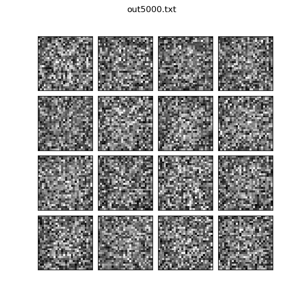
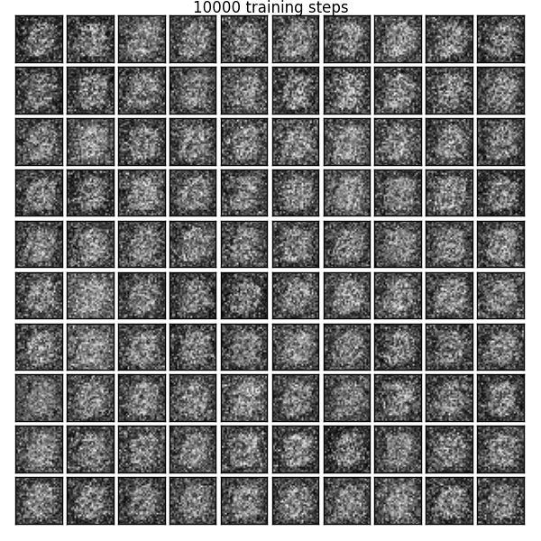

[Generative Adverserial Networks](https://en.wikipedia.org/wiki/Generative_adversarial_network)
were introduced in 2014 by Goodfellow et al[1](#bib1). 

GANs are generative models: after training a GAN on a dataset it should be
able to produce content very similar to what the original dataset holds.
They are made of two nets, a *Generator* and a *Discriminator*, that compete
against each other in a zero-sum game.

Consider a dataset of images.

* The goal of the Generator is to produce an image that is difficult to
  distinguish from real dataset images. The Generator has access to vector of
  random noise called *latent space*. The Generator's output is called
  a *fake* image.
* The Discriminator takes as input an image, either fake or real, and has to
  output the probability that the image is real.

During training the Discriminator gets better at recognizing fake images from
real which makes the task of the Generator more difficult so the Generator gets
better at producing realistic images.

# GANs applied to the MNIST dataset

In this [example](https://github.com/LaurentMazare/tensorflow-ocaml/tree/master/examples/gan/mnist_gan.ml)
we use some simple GAN architecture to generate images similar to the MNIST dataset of hand written
digits.

Both the Generator and the Discriminator use a single hidden layer of 128 nodes.
The latent space has size 100. Leaky ReLU are used as an activation to make training more stable.
The output of the Generator goes through a tanh activation function so that it is normalized
between -1 and 1. Real MNIST images are also normalized between -1 and 1.

The Discriminator loss uses binary cross-entropy. Some smoothing is applied to the real label.

We generate some output samples using the Generator at various points during training.
Note that we use the same random values for these sampled values at these different
points as it makes it easier to see progresses.

# Conditional GANs

Conditional GANs (cGANs) are a simple variant of the original GANs that were presented by
Mirza and Osindero in 2014[2](#bib2).
In cGANs both the Generator and Discriminator take as additional input some annotations
for which ground truth is available in the original dataset.
In the MNIST case the digit class encoded as a one-hot vector is used. For real
images the actual label is used, for fake images both the Discriminator and the
Generator receive the same label. The Generator now has to learn to produce
realistic outputs conditional on the labels.

The same architecture is used as in the previous example.  This
[example](https://github.com/LaurentMazare/tensorflow-ocaml/tree/master/examples/gan/mnist_cgan.ml)
uses cGANs to generate MNIST digits.

The gif below illustrates the progress made by the Generator in the training
process. Note that it is now easy to ask the Generator to produce images for
a given class.

# Bibliography
<a name="bib1">1</a>: 
Generative Adversarial Networks.
Ian J. Goodfellow, Jean Pouget-Abadie, Mehdi Mirza, Bing Xu, David Warde-Farley, Sherjil Ozair, Aaron Courville, Yoshua Bengio.
[arXiv:1406.2661](https://arxiv.org/abs/1406.2661) 2014.

<a name="bib2">1</a>: 
Conditional Generative Adversarial Nets.
Mehdi Mirza, Simon Osindero.
[arXiv:1411.1784](https://arxiv.org/abs/1411.1784) 2014.

